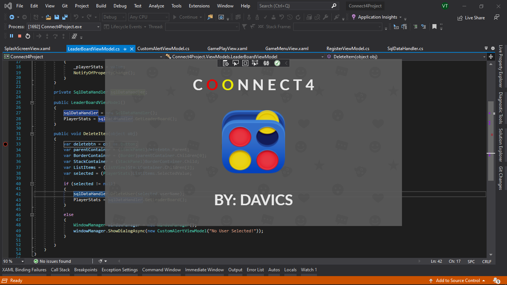
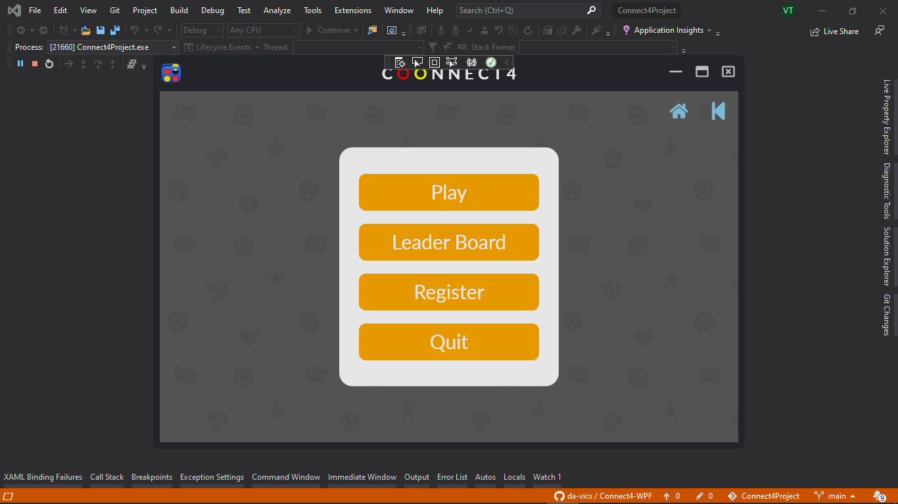
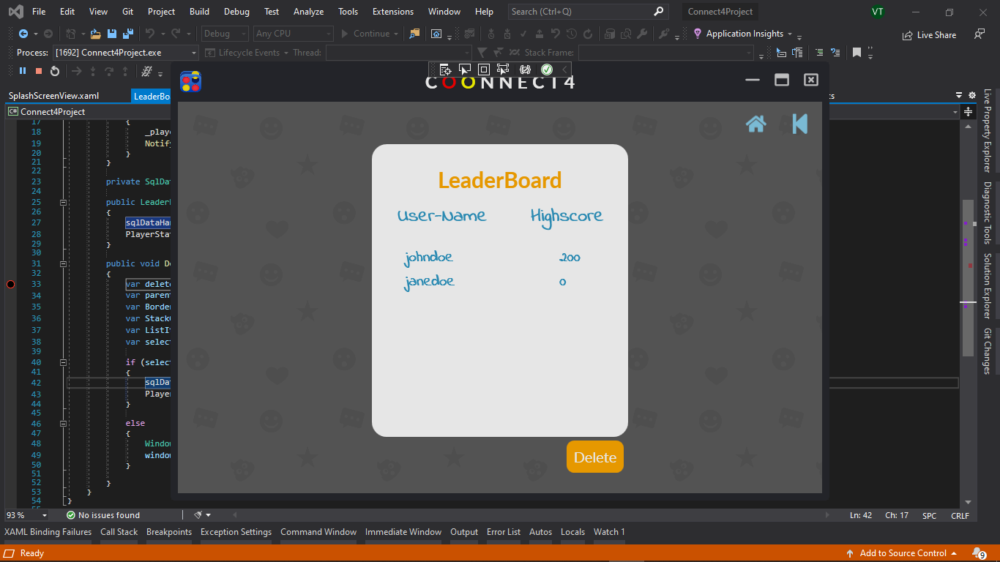
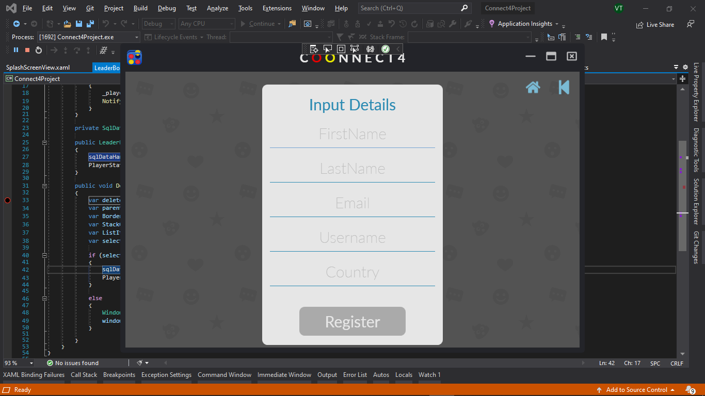
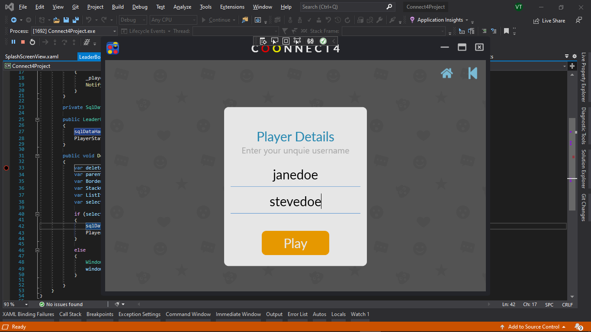
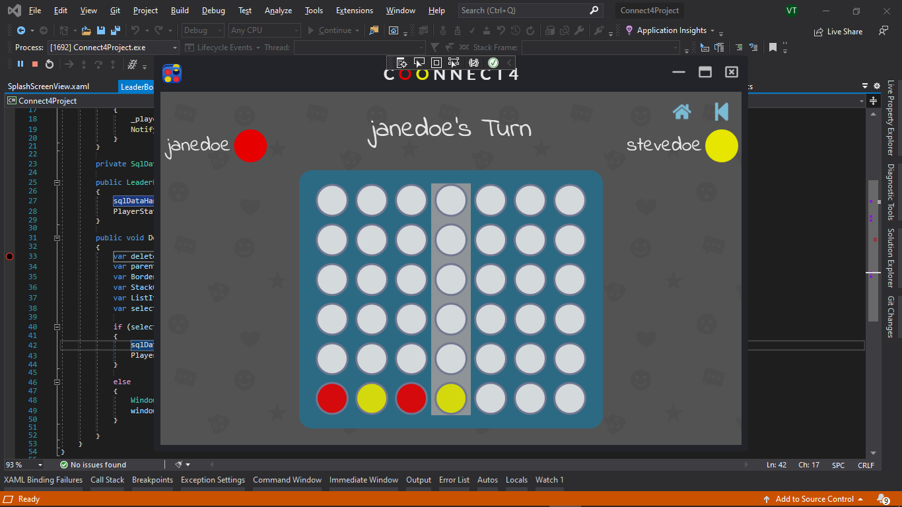
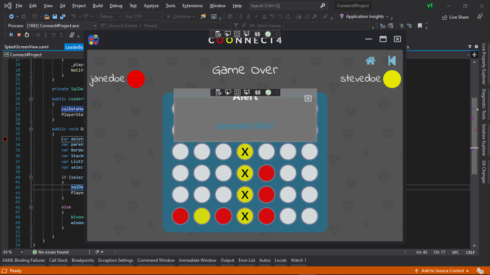

# Connect4-WPF
Connect4 WPF Game

Connect4 WPF Game
ORM  @ https://github.com/Caliburn-Micro/Caliburn.Micro
DATABASE  MSSQL
MVVM FRAMEWORK @ https://github.com/Caliburn-Micro/Caliburn.Micro

<h3>SplashScreen</h3>

 </img>

<h3>HomeScreen</h3>

 </img>

<h3>LeaderBoard</h3>

 </img>

<h3>Register Players</h3>

 </img>

<h3>Sign in to Play</h3>

 </img>

<h3>GamePlay</h3>

 </img>

<h3>Win</h3>

 </img>

